<picture>
  <source media="(prefers-color-scheme: dark)" srcset="assets/header-dark.svg">
  
</picture>

<details>
<summary><b>📄 in a hurry? recruiter mode</b> — the same page, cricket removed</summary>

<br>

**Aum Vyas** — B.Tech Electronics & Communication Engineering, IIT Bhubaneswar (2023–2027), CGPA 8.98/10.

**Experience** — Software Engineering Intern, Google AI Garage, Hyderabad (May–Aug 2026). Architected a Python SDK for multi-party calendar negotiation using hexagonal architecture with 6 swappable adapters across 60+ peer-reviewed changelists; built a dual-FSM negotiation core with Try-Confirm-Cancel reservations; shipped via a 3-node Google ADK workflow over Google Calendar APIs, OAuth 2.0, Gemini and Cloud Spanner; held sub-100 ms SDK overhead under P90 latency profiling.

**Projects** — *Meridian*: real-time investment research platform, 5 data sources, 4 Kafka/Pathway pipelines, Hoeffding-tree drift detection, agentic decision layer behind 4 fail-closed gates, 260+ tests. *PathFin*: agentic RAG over 10K+ documents, sub-50 ms retrieval at 95% precision, Leader–Analyst multi-agent orchestration at 200 ms overhead, 83.9% LLM-judged relevance. *WittyWicket*: real-time AI sports commentary on Agno and Pathway, adapter-based ingestion across 4 sports.

**Skills** — Python, C++, SQL (adept); C, JavaScript, TypeScript, Protocol Buffers (familiar). FastAPI, REST, OAuth 2.0, Kafka, Cloud Spanner, PostgreSQL, MongoDB. Docker, Git, Google ADK, Prometheus, Grafana, Pathway. PyTorch, Hugging Face, LangChain, LangGraph, Agno, RAG, multi-agent systems. Verilog, RTL, FSM design.

**Achievements** — Inter IIT Tech Meet 13.0: 8th of 23 IITs (Pathway). GC 2025 ML Hackathon, IIT Bhubaneswar: 1st place.

**Contact** — [23ec01005@iitbbs.ac.in](mailto:23ec01005@iitbbs.ac.in) · [linkedin.com/in/aumvyas](https://linkedin.com/in/aumvyas)

</details>

|  |  |
|---|---|
| `[1]` [who even is this](#whoami) | `[4]` [the google thing](#google) |
| `[2]` [things i will argue about](#opinions) | `[5]` [the toolbox](#stack) |
| `[3]` [the three real ones](#work) | `[6]` [receipts & reaching him](#contact) |

<br>

<a id="whoami"></a>
## `[1]` who even is this

```console
$ whoami
  aum vyas · b.tech ece '27 · iit bhubaneswar
  swe intern @ google ai garage · hyderabad · may–aug 2026

$ cat ~/.thesis
  everyone can get a model to say something.
  the hard part is making it prove it, and stopping it when it can't.
  so i build the boring half: streaming ingest, live indexes,
  routers, and gates that fail closed.
```

<br>

<a id="opinions"></a>
## `[2]` things i will argue about

```diff
+ the llm is the slowest, least testable part of your system. give it one job.
+ a rag system that can't say "i don't know" is a liability with a vector index.
+ fail closed. an agent that leans toward action will, eventually, act.
+ evals or it didn't happen. "it looked right in the demo" is not a metric.
+ report p95. the average is where the users who left are hiding.
- most agent frameworks are a while-loop with opinions.   (i still use them.)
```

<br>

<a id="work"></a>
## `[3]` the three real ones

Everything he builds ends up the same shape:

<picture>
  <source media="(prefers-color-scheme: dark)" srcset="assets/pipeline-dark.svg">
  
</picture>

### 📈 [Meridian](https://github.com/GeekyAum/Meridian) · *investment research that won't spend your money*

```diff
+ the model can:    recommend a paper trade, citing the drift alert behind it
- the model can't:  touch a broker. 5 read-only tools, 4 fail-closed gates, 0 real money
```

- **5 financial feeds → 4 Kafka + Pathway pipelines → 15+ market features** over FastAPI, on PostgreSQL and MongoDB.
- Online **Hoeffding Adaptive Tree** drift detection on 300-tick windows — KL/KS tests, 2-confirmation debouncing, alerts over Kafka and SSE.
- **Agno + Gemini** decision service behind **5 read-only MCP tools**. `260+ host tests` · `18 integration tests` · offline-first.

<sub>`python` `fastapi` `kafka` `pathway` `postgresql` `mongodb` `prometheus` `grafana` `docker` `agno`</sub>

### 🧭 [PathFin](https://github.com/GeekyAum/Dynamic-Agentic-RAG) · *retrieval that sizes up your question first*

```diff
+ the model can:    answer, after a classifier decides how hard you're asking
- the model can't:  pad the context "just in case". more documents only for hard queries
```

- **10K+ multi-modal docs** in a Pathway VectorStore — **sub-50 ms** search at **95% LLM-judged precision** over 2K queries.
- **Leader–Analyst** agents on GPT-4o split and reconcile subtasks with **200 ms** orchestration overhead. The rest of the 35–40 s p95 is the model thinking, and he can prove it.
- **83.9% LLM-judged relevance**, with zero hallucinations flagged across the 2K-query eval.

<sub>`python` `pathway` `gpt-4o` `fastapi` `docker` `multi-agent rag` `opik`</sub>

### 🏏 [WittyWicket](https://github.com/GeekyAum/WittyWicket) · *live sport, narrated by agents*

```diff
+ the model can:    commentate, ball by ball, from a live feed
- the model can't:  invent a six. every line is grounded in retrieved match history
```

- Streaming match feeds → **Agno** agents + **Pathway VectorStore** → play-by-play that can cite the over it's talking about.
- One **adapter interface**, **4 scrapers** today (cricket, football, basketball, tennis). A new sport is one class away.

<sub>`python` `agno` `pathway` `docker` `web scraping`</sub>

<details>
<summary><b>🗄️ the shelf out back</b> — smaller things, forks, and one Verilog rabbit hole</summary>

<br>

- **[Digital-Design](https://github.com/GeekyAum/Digital-Design)** — Verilog reference designs: RTL, FSMs, FPGA basics. The ECE degree occasionally demands tribute.
- **[narrative-core](https://github.com/GeekyAum/narrative-core)** — AI-driven storytelling system, contributing upstream.
- **[Portfolio](https://github.com/GeekyAum/Portfolio)** — hand-built site. No framework, no build step, no regrets.

</details>

<br>

<a id="google"></a>
## `[4]` the google thing

```console
$ cat ~/experience/google-ai-garage.md
  software engineering intern · ai garage · hyderabad · may – aug 2026
```

- A **Python SDK for multi-party calendar negotiation**, on a **hexagonal (ports-and-adapters)** architecture — **6 swappable adapters**, **60+ peer-reviewed changelists**.
- The core is **two finite-state machines** negotiating in rounds. Double-booking races die to **Try-Confirm-Cancel** reservations and auto-expiring locks.
- Shipped into an internal scheduling app via a **3-node Google ADK workflow**: Calendar APIs, OAuth 2.0, Pydantic, **Gemini**, **Cloud Spanner**.
- **Sub-100 ms** SDK overhead at P90, profiled until it was provable that the LLM was the bottleneck, not the code.

<picture>
  <source media="(prefers-color-scheme: dark)" srcset="assets/chip-google-dark.svg">
  
</picture>

<br>

<a id="stack"></a>
## `[5]` the toolbox

<picture>
  <source media="(prefers-color-scheme: dark)" srcset="assets/stack-dark.svg">
  
</picture>

<br>

<a id="contact"></a>
## `[6]` receipts & reaching him

```diff
+ Inter IIT Tech Meet 13.0      8th of 23 IITs · Pathway problem statement     Dec 2024
+ GC 2025 ML Hackathon          1st place · IIT Bhubaneswar                    Mar 2025
! Internship Coordinator        Career Development Cell, IIT BBS      Apr '25 – Mar '26
! Governor                      Soc. of Finance, Econ & DS, IIT BBS   Apr '25 – Mar '26
```

**Open to internships and full-time roles** in AI engineering and backend systems.
If you're building something that has to think *and* has to be right, that's the interesting part.

📮 [23ec01005@iitbbs.ac.in](mailto:23ec01005@iitbbs.ac.in) · 💼 [in/aumvyas](https://linkedin.com/in/aumvyas)

<br>

<details>
<summary><b>🦗 poke chip</b></summary>

<br>

<picture>
  <source media="(prefers-color-scheme: dark)" srcset="assets/chip-ow-dark.svg">
  
</picture>

<picture>
  <source media="(prefers-color-scheme: dark)" srcset="assets/chip-fact-dark.svg">
  
</picture>

**why a cricket, though?** Three reasons, all the same reason:

1. **WittyWicket** does live *cricket* commentary.
2. He's an **ECE** student, so the pet is named **Chip**.
3. 🦗 is the universal sound of a dead repo. Keeping one alive on the profile felt like the right kind of threat.

<picture>
  <source media="(prefers-color-scheme: dark)" srcset="assets/chip-cricket-dark.svg">
  
</picture>

</details>

<picture>
  <source media="(prefers-color-scheme: dark)" srcset="assets/chip-sleep-dark.svg">
  
</picture>

<a href="https://github.com/GeekyAum?tab=repositories"></a>
